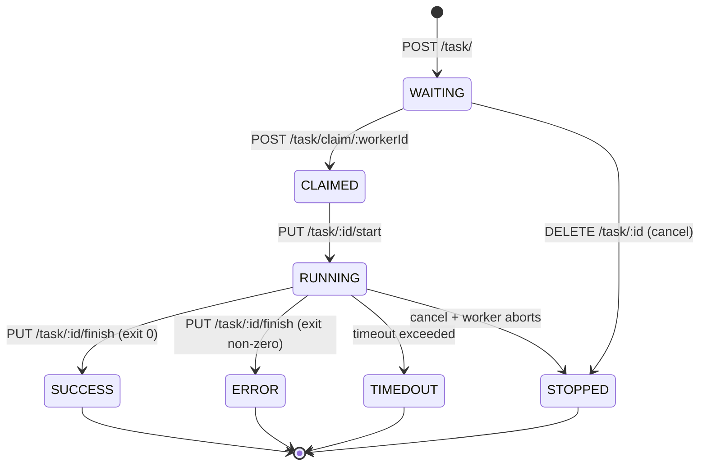
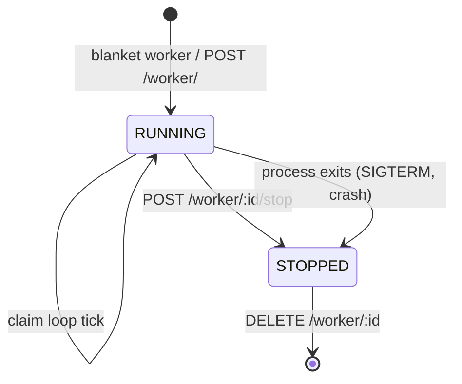

# Design & Origin

## Origin

Blanket was designed because of problems I saw on several projects in
[GTRI's ELSYS branch](https://www.gtri.gatech.edu/elsys) where we
wanted to be able to integrate a piece of software with a less than
awesome API into another tool. Whether that software was a long running
simulation, a CAD renderer, or some other strange beast, we kept seeing
people try to wrap HTTP servers around these utilities. This seemed
unnecessary and wasteful.

The starting concept of blanket was simple: If we can wrap anything with
a command line call (which is possible with tools like
[sikuli](http://www.sikuli.org/)), and we could make it easy to expose
any command line script as a web endpoint, then we can provide a nice
consistent way to expose cool software with a possibly bad API to a
larger class of users.

The first draft of blanket was written in python and used celery for
queuing. It worked fine, but was a bit heavy weight, and was hard for
some Windows users to install. Go was chosen for the rewrite since:

* It compiles to a single binary, so deployment is easy
* It cross compiles to many platforms, so getting it to behave on
  Windows shouldn't be too painful

## Design Goals

> This is how we want it to work, not necessarily how it works now.

* Speed is not a high priority at the moment. Instead, we favor:
    * **Simplicity** — API is easy to work with, and tasks are hard to lose
    * **Pluggability** — easy to change storage and queue backends while maintaining the same API
    * **Traceability** — easy to understand what's going on
    * **Openness** — easy to get data in and out
    * **Low resource usage** — like [xinetd](https://en.wikipedia.org/wiki/Xinetd), it can be present and usable without you thinking about it
* Blanket is designed for long running tasks, not high speed messaging. We assume:
    * Tasks will be running for a long time (several seconds or more)
    * Contention between workers will be fairly low
* TOML files drive all configuration for tasks
* The web UI is optional — everything can be done without it, easily. The main feature is the JSON/REST interface.

## Architecture

* Go modules for dependency management
* `//go:embed` for static files (see `server/ui_next.go`)
* Server-rendered Go templates + [htmx](https://htmx.org/) for the web UI
* BoltDB for storage; internal queue abstraction
* Gin for HTTP routing
* Single binary — server and worker are the same binary invoked with different subcommands

See [the docs directory](https://github.com/turtlemonvh/blanket/tree/master/docs) for more detailed information.

## State Machines

### Task lifecycle

A task moves through one of two terminal paths: it is claimed and run
to completion (`SUCCESS` / `ERROR` / `TIMEDOUT`), or it is cancelled
(`STOPPED`) — either before a worker claims it, or after the worker
sees the cancellation tombstone and aborts.

Valid states are listed in `tasks.ValidTaskStates` (`tasks/tasks.go`);
terminal states in `ValidTerminalTaskStates`.

### Worker lifecycle

Workers have a simpler model: a single `Stopped` boolean on the
`WorkerConf` (`worker/worker.go`). A running worker polls the queue
on its `CheckInterval`; setting `Stopped = true` (via
`POST /worker/:id/stop` or the worker process exiting) takes it out
of the claim loop. Workers can only be deleted once stopped.

A worker that has stopped reporting heartbeats (`lastHeardTs`) is
considered "lost" by the UI but is not a distinct state in the data
model — there is no automatic transition; an operator must stop or
delete it explicitly.
