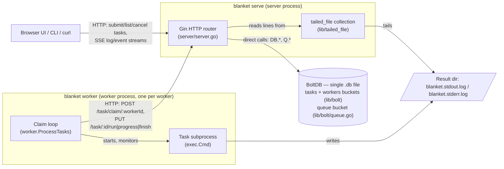

# Design & Origin

## Origin

Blanket was designed because of problems I saw on several projects in
[GTRI's ELSYS branch](https://www.gtri.gatech.edu/elsys) where we
wanted to be able to integrate a piece of software with a less than
awesome API into another tool. Whether that software was a long running
simulation, a CAD renderer, or some other strange beast, we kept seeing
people try to wrap HTTP servers around these utilities. This seemed
unnecessary and wasteful.

The starting concept of blanket was simple: If we can wrap anything with
a command line call (which is possible with tools like
[sikuli](http://www.sikuli.org/)), and we could make it easy to expose
any command line script as a web endpoint, then we can provide a nice
consistent way to expose cool software with a possibly bad API to a
larger class of users.

The first draft of blanket was written in python and used celery for
queuing. It worked fine, but was a bit heavy weight, and was hard for
some Windows users to install. Go was chosen for the rewrite since:

* It compiles to a single binary, so deployment is easy
* It cross compiles to many platforms, so getting it to behave on
  Windows shouldn't be too painful

## Design Goals

> This is how we want it to work, not necessarily how it works now.

* Speed is not a high priority at the moment. Instead, we favor:
    * **Simplicity** — API is easy to work with, and tasks are hard to lose
    * **Pluggability** — easy to change storage and queue backends while maintaining the same API
    * **Traceability** — easy to understand what's going on
    * **Openness** — easy to get data in and out
    * **Low resource usage** — like [xinetd](https://en.wikipedia.org/wiki/Xinetd), it can be present and usable without you thinking about it
* Blanket is designed for long running tasks, not high speed messaging. We assume:
    * Tasks will be running for a long time (several seconds or more)
    * Contention between workers will be fairly low
* TOML files drive all configuration for tasks
* The web UI is optional — everything can be done without it, easily. The main feature is the JSON/REST interface.

## Architecture

* Go modules for dependency management
* `//go:embed` for static files (see `server/ui.go`)
* Server-rendered Go templates + [htmx](https://htmx.org/) for the web UI
* BoltDB for storage; internal queue abstraction
* Gin for HTTP routing
* Single binary — server and worker are the same binary invoked with different subcommands

### Components

`blanket serve` and `blanket worker` are the same binary, but they are
**separate processes**, and only the server process touches storage.
`command/serve.go` is the only place that calls
`bolt.MustOpenBoltDatabase()`, wiring the resulting `*bolt.DB` handle into
both `bolt.NewBlanketBoltDB` (the `tasks`/`workers` buckets) and
`bolt.NewBlanketBoltQueue` (the queue bucket) — one `.db` file, one
process holding the lock (see the BoltDB single-writer gotcha in
[`CLAUDE.md`](../CLAUDE.md)). A worker process never opens that file; it
talks to the server exclusively over `localhost` HTTP (`tasks/task_client.go`,
`worker/worker.go`), the same API a browser or `curl` client uses. This
matters when reading the diagram below: "worker → server" is a real
network hop (loopback, but HTTP), not an in-process call, while
"server → BoltDB" is a direct library call in one process.

```mermaid
flowchart LR
    client["Browser UI / CLI / curl"]

    subgraph serverproc["blanket serve (server process)"]
        router["Gin HTTP router<br/>(server/server.go)"]
        tf["tailed_file collection<br/>(lib/tailed_file)"]
    end

    db[("BoltDB — single .db file<br/>tasks + workers buckets (lib/bolt)<br/>queue bucket (lib/bolt/queue.go)")]

    subgraph workerproc["blanket worker (worker process, one per worker)"]
        claimloop["Claim loop<br/>(worker.ProcessTasks)"]
        subcmd["Task subprocess<br/>(exec.Cmd)"]
    end

    logs[/"Result dir: blanket.stdout.log / blanket.stderr.log"/]

    client -- "HTTP: submit/list/cancel tasks,<br/>SSE log/event streams" --> router
    router -- "direct calls: DB.*, Q.*" --> db
    router -- "reads lines from" --> tf
    tf -- "tails" --> logs

    claimloop -- "HTTP: POST /task/claim/:workerId,<br/>PUT /task/:id/run|progress|finish" --> router
    claimloop -- "starts, monitors" --> subcmd
    subcmd -- "writes" --> logs
```

### Shutdown sequence

The server owns its own signal handling and tears down in a fixed order
(`server/lifecycle.go`). The order is the point — the steps are not
independent:

| # | Step | Why here |
| - | ---- | -------- |
| a | Signal shutdown to the streaming handlers | `net/http`'s `Shutdown` waits *indefinitely* on an active connection and never force-closes one. Each SSE handler selects on a server-wide shutdown channel, emits a `retry:` hint plus a `server-restarting` event, and returns. Miss one call site and every restart hangs forever. |
| b | `http.Server.Shutdown(ctx)` | Stop accepting connections; drain what's in flight. 5 s deadline. |
| c | `http.Server.Close()` | Only if (b) hit its deadline: cut whatever is still open. |
| d | `tailed_file.StopAll()` | Only now is this safe. No handler can still be reading from a tailer. Doing it *first* was a real bug in the `graceful.v1` setup this replaces: its `BeforeShutdown` hook ran before the listener closed, leaving in-flight log-stream handlers blocked on a torn-down tailer. |
| e | Cancel the background loops | The scheduler today (`server/scheduler.go`); the reaper joins it there in a later phase. |
| f | Close the BoltDB handle | Last, because everything above may still touch storage — and because closing it is what releases the flock, which the next step needs. |

Signals:

* **SIGINT / SIGTERM** — drain and exit 0, leaving nothing that would
  bring the server or its workers back. A plain `systemctl stop` must not
  resurrect anything later.
* **SIGUSR2** (unix only) — drain as above, then `syscall.Exec` the binary
  at `os.Executable()` with the same argv and environment. The process
  image is replaced in place: same PID, same file descriptors 0/1/2, so a
  server started under `nohup` or in tmux keeps its terminal and its logs.
  Because the database was closed in step (f), the new image can take the
  flock. Windows has no equivalent and never self-restarts — a detached
  grandchild escapes a service's job object and would hold the bolt lock
  invisibly, which is the worst failure mode in the system.

Timeouts on the `http.Server`: `ReadHeaderTimeout` 10 s and `IdleTimeout`
120 s. `WriteTimeout` and `ReadTimeout` are deliberately left at zero —
`WriteTimeout` is an absolute deadline on the whole response, so any
nonzero value would kill every SSE stream in the app, and `ReadTimeout`
would cap the whole request read including multipart uploads to
`POST /task/`.

Testing this needs a real process — signal delivery, exit codes, the
BoltDB flock and `os.Executable()` are all cross-process properties — so
`scripts/restart.sh` drives the built binary through the shared subprocess
harness (`scripts/lib/harness.sh`). The in-process half, including a test
that holds all four streaming routes open across a shutdown, is in
`server/lifecycle_test.go`.

See the [docs index](./README.md) for more detailed information, including the [task flow and state machines](./task_flow.md).
