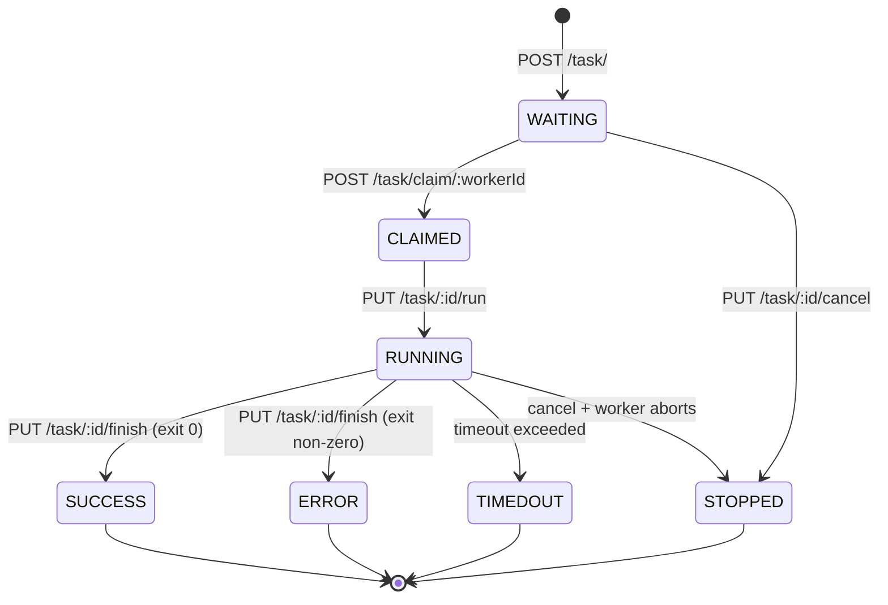
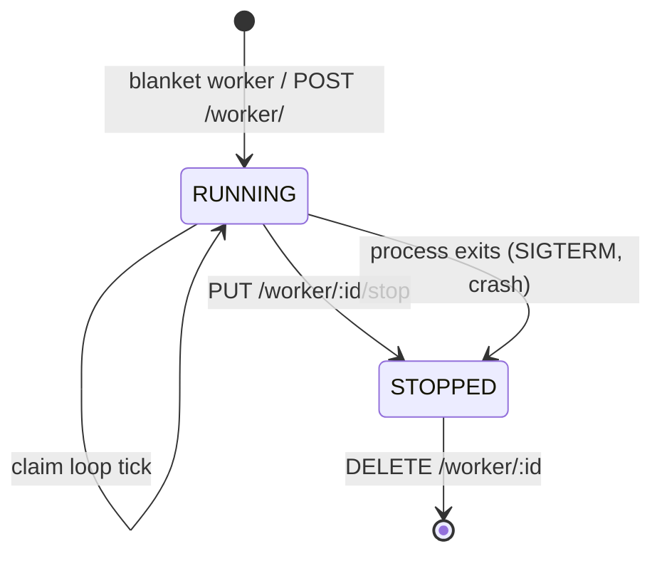

# Task Flow

This page documents the workflow that tasks go through, and the state
machines for tasks and workers.

## Task states

| State | Description |
| ------ | ------- |
| WAITING | Task has been posted but is not being worked on. The task is in the queue. |
| CLAIMED | A worker has requested this task. The task is now out of the queue and state is maintained only in the database. |
| RUNNING | The worker has executed the task preconditions (such as grabbing task type state, copying files) and the main command is now running. The worker may send additional updates during this state. |
| ERROR | The worker has encountered an error while running the task. Any non-zero status code is interpreted as an error. |
| SUCCESS | The worker has finished task execution. |
| STOPPED | The worker has received a command to stop execution of this task and the command has been killed. |
| TIMEDOUT | The task took longer than the allowed time and was killed. |

Valid states are listed in `tasks.ValidTaskStates` (`tasks/tasks.go`);
terminal states in `ValidTerminalTaskStates`.

## Task state machine

A task moves through one of two terminal paths: it is claimed and run
to completion (`SUCCESS` / `ERROR` / `TIMEDOUT`), or it is cancelled
(`STOPPED`) — either before a worker claims it, or after the worker
sees the cancellation tombstone and aborts.

## Worker state machine

Workers have a simpler model: a single `Stopped` boolean on the
`WorkerConf` (`worker/worker.go`). A running worker polls the queue
on its `CheckInterval`; setting `Stopped = true` (via
`PUT /worker/:id/stop` or the worker process exiting) takes it out
of the claim loop. Workers can only be deleted once stopped.

A worker that has stopped reporting heartbeats (`lastHeardTs`) is
considered "lost" by the UI but is not a distinct state in the data
model — there is no automatic transition; an operator must stop or
delete it explicitly.

## Basic task flow

This is what the workflow looks like without any user intervention or
failures.

### 0. Preconditions / Assumptions

We start out with the assumptions that:

1. Blanket itself is running.
2. Workers are running, and they can consume tasks.

### 1. User posts task

User sends `POST /task/`. They receive back an id for their task.
The task is put in both the database and the queue. The write to the
database is performed first.

### 2. Worker claims task

Workers do not claim specific tasks. They send a specification of their
capabilities to the server via `POST /task/claim/:workerId`. The server
responds by executing a series of actions:

1. Find a task that matches that worker's capability in the queue.
2. Insert that task into the database in the `CLAIMED` state, and ack the message from the queue.
3. Return the task id of the claimed task to the worker.

### 3. Worker begins task execution

Upon receipt of this task id from the server, the worker starts
performing its own series of actions to advance the task state:

1. Grab the task type information.
2. Create an isolated execution directory for the task. Copy any template files in this directory and fill them out.
3. Start executing the main task command.
4. Send a `PUT /task/:id/run` back to the server to request the server advances the task state to `RUNNING`.

> Note that **the task config is not locked when the task is added**,
> but when it is executed. If you change the input files in the time
> between when a task is added and when it is executed, you will
> execute the new version of the task. This may change in the future.

During execution, the worker may send multiple requests to
`PUT /task/:id/progress` to update the percent completion of the task,
or adjust other task attributes.

### 4. Worker completes task execution

Assuming the task execution completes without any errors, timing out,
or being stopped by the user, the worker will then:

1. Send a request to `PUT /task/:id/finish` to mark the task as complete.
2. Ask the server for another task.
