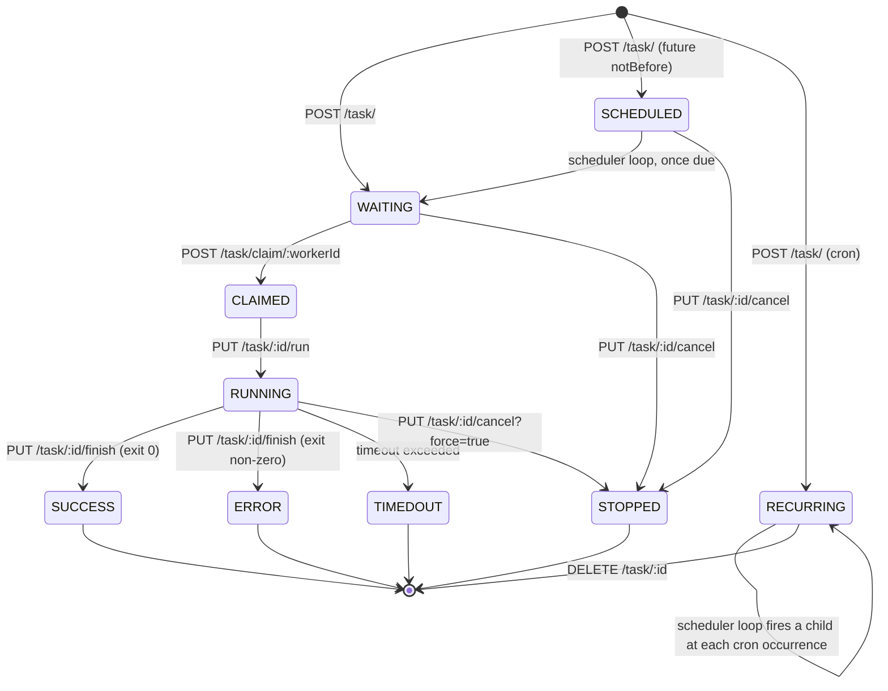
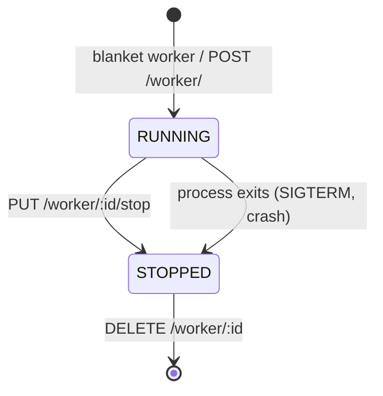
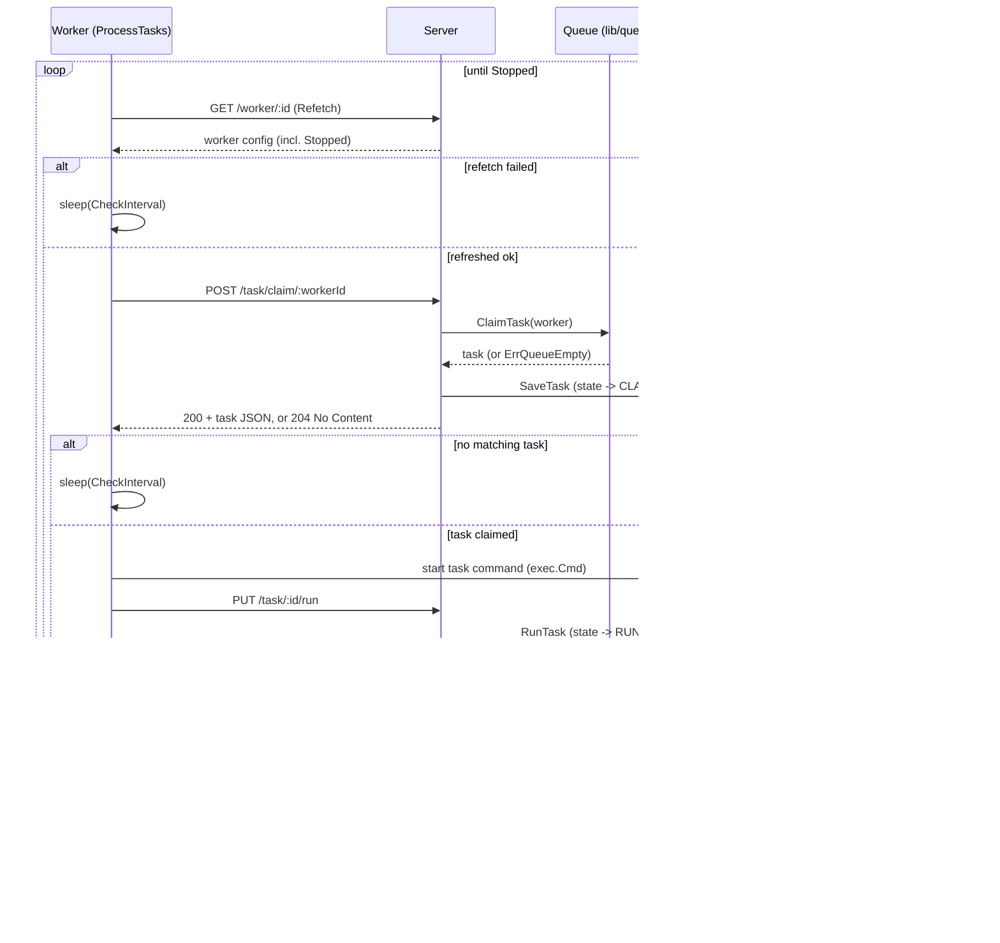
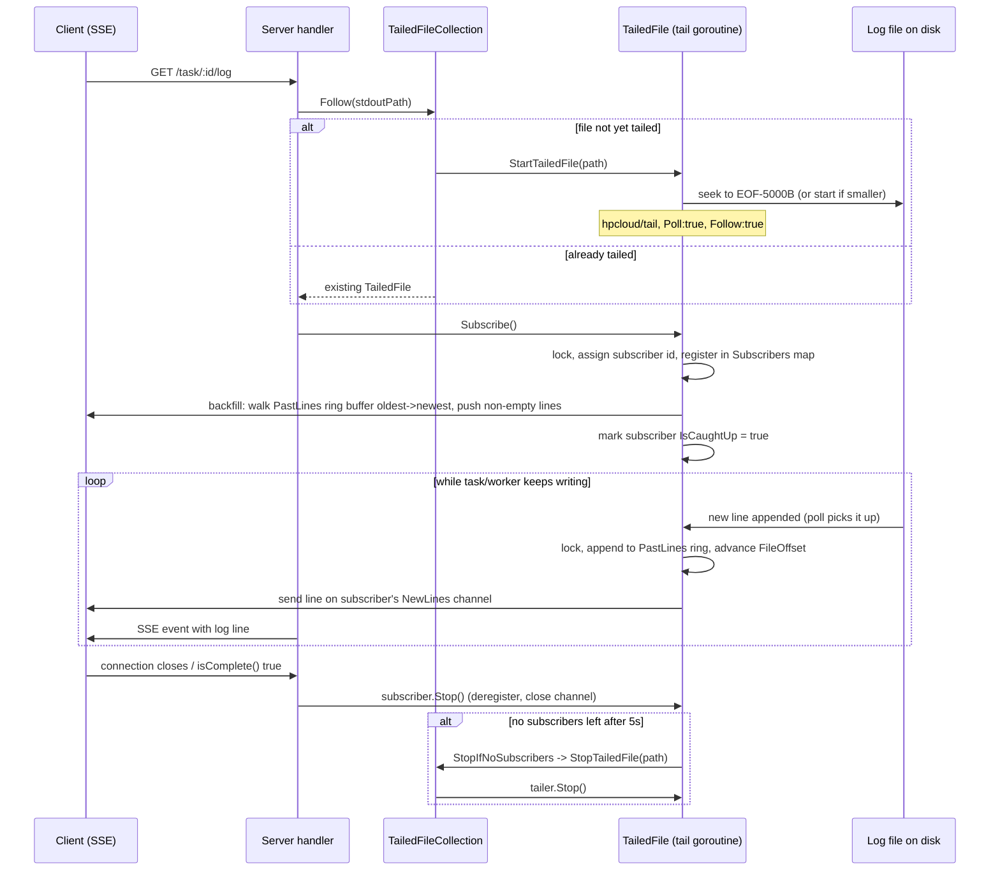

# Task Flow

This page documents the workflow that tasks go through, and the state
machines for tasks and workers.

## Task states

| State | Description |
| ------ | ------- |
| SCHEDULED | Task was submitted with a future `notBefore`; not yet in the queue. See "Scheduling" below. |
| RECURRING | Task is a recurring template (submitted with `cron`); never runs itself, only spawns children. See "Scheduling" below. |
| WAITING | Task has been posted but is not being worked on. The task is in the queue. |
| CLAIMED | A worker has requested this task. The task is now out of the queue and state is maintained only in the database. |
| RUNNING | The worker has executed the task preconditions (such as grabbing task type state, copying files) and the main command is now running. The worker may send additional updates during this state. |
| ERROR | The worker has encountered an error while running the task. Any non-zero status code is interpreted as an error. |
| SUCCESS | The worker has finished task execution. |
| STOPPED | The worker has received a command to stop execution of this task and the command has been killed. |
| TIMEDOUT | The task took longer than the allowed time and was killed. |

Valid states are listed in `tasks.ValidTaskStates` (`tasks/tasks.go`);
terminal states in `ValidTerminalTaskStates`.

## Task state machine

A task moves through one of two terminal paths: it is claimed and run
to completion (`SUCCESS` / `ERROR` / `TIMEDOUT`), or it is cancelled
(`STOPPED`) — either before a worker claims it, or after the worker
sees the cancellation tombstone and aborts.

```mermaid
stateDiagram-v2
    [*] --> WAITING: POST /task/
    [*] --> SCHEDULED: POST /task/ (future notBefore)
    [*] --> RECURRING: POST /task/ (cron)
    SCHEDULED --> WAITING: scheduler loop, once due
    SCHEDULED --> STOPPED: PUT /task/:id/cancel
    RECURRING --> RECURRING: scheduler loop fires a child at each cron occurrence
    RECURRING --> [*]: DELETE /task/:id
    WAITING --> CLAIMED: POST /task/claim/:workerId
    WAITING --> STOPPED: PUT /task/:id/cancel
    CLAIMED --> RUNNING: PUT /task/:id/run
    RUNNING --> SUCCESS: PUT /task/:id/finish (exit 0)
    RUNNING --> ERROR: PUT /task/:id/finish (exit non-zero)
    RUNNING --> TIMEDOUT: timeout exceeded
    RUNNING --> STOPPED: PUT /task/:id/cancel?force=true
    SUCCESS --> [*]
    ERROR --> [*]
    TIMEDOUT --> [*]
    STOPPED --> [*]
```

### Scheduling: `scheduledTs` / recurring tasks (turtlemonvh/blanket#61)

By default a submitted task is immediately eligible to be claimed
(`WAITING`, in the queue). Two request fields on `POST /task/` change
that — see [api.md](api.md#tasks) for the exact field shapes:

- **`notBefore`** delays a one-shot task. If the resolved time is in the
  future, the task is saved to the database in state `SCHEDULED` with
  `scheduledTs` set, but is **not** added to the queue. It's otherwise a
  normal task record — visible via `GET /task/:id`, cancelable via `PUT
  /task/:id/cancel` (no `force` needed, same as `WAITING`).
- **`cron`** turns the submitted task into a `RECURRING` **template**. A
  template is never itself queued or run. Instead it carries `cronExpr`
  and `nextFireTs`; when `nextFireTs` is reached the scheduler spawns a
  **child task** — a fresh id, its own log/result directory, the
  template's type/env/tags, and `parentId` set to the template's id — and
  that child goes through the ordinary `WAITING` → ... lifecycle above.
  The template then advances `nextFireTs` to the next cron occurrence and
  waits again. A template is stopped by **deleting** it
  (`DELETE /task/:id`) — not by cancelling it, since it's neither queued
  nor running. Deleting the template does not affect children it already
  spawned; they run to their own completion independently.

Both `SCHEDULED` tasks and `RECURRING` templates are ordinary rows in the
task database (BoltDB), so they survive a server restart with no special
handling: on restart the scheduler loop simply finds whatever is already
due and acts on it.

#### Scheduler loop

A single background goroutine, started from `ServerConfig.Serve()` via
`startBackgroundLoops` (`server/scheduler.go`), ticks on a configurable
interval (`scheduler.interval` config key, default `2s`) and each tick:

1. **Promotes due `SCHEDULED` tasks**: finds every `SCHEDULED` task whose
   `scheduledTs` has passed, flips it to `WAITING`, and adds it to the
   queue. Safe to run more than once for the same task — the DB write is
   a plain overwrite and the queue add upserts by task id — so an
   overlapping tick or a restart mid-promotion can't double-queue a task.
2. **Fires due `RECURRING` templates**: finds every `RECURRING` template
   whose `nextFireTs` has passed, spawns a child task for it, and only
   then advances `nextFireTs`. If the server crashes between spawning the
   child and advancing `nextFireTs`, the template is found due again on
   restart and fires an equivalent child a second time — an
   at-least-once guarantee, not exactly-once. Task types driven by cron
   should be written to tolerate an occasional duplicate run, the same
   way a `cron(8)`-driven script generally should.

`startBackgroundLoops` is written so a second periodic loop can be added
alongside the scheduler with one more line — see the FIXME it replaced in
`server/server.go`; turtlemonvh/blanket#23 phase 3 plans to add a reaper
loop there (stalled workers/tasks, unclaimed-queue cleanup).

### Stopping a RUNNING task

`PUT /task/:id/cancel` on a WAITING task is a pure database transition — the
task was never claimed, so there's nothing else to signal. On a RUNNING task
it's more consequential: the task's OS process is a subprocess of some
*worker*, not the server, so the server can't kill it directly. Cancelling a
RUNNING task therefore requires an explicit `?force=true`; without it the
endpoint returns 400 and leaves the task alone.

With `force=true`, the server does its half — flip the task to `STOPPED` in
the database — and relies on the worker to do the rest. Each worker's
`ProcessOne` (`worker/worker.go`) runs a monitor goroutine alongside the
subprocess that polls the task's state every `CheckInterval` (same interval
the worker already uses for its claim loop); when it observes `STOPPED` it
kills the subprocess (`cmd.Process.Kill()`) and returns. So "stopping" a
RUNNING task is: server sets the tombstone, worker's next poll notices it and
kills the process — no direct server-to-worker RPC involved. Worst case, the
subprocess keeps running for up to one `CheckInterval` after the cancel call
before it's killed.

## Worker state machine

Workers have a simpler model: a single `Stopped` boolean on the
`WorkerConf` (`worker/worker.go`). A running worker polls the queue
on its `CheckInterval`; setting `Stopped = true` (via
`PUT /worker/:id/stop` or the worker process exiting) takes it out
of the claim loop. Workers can only be deleted once stopped.

```mermaid
stateDiagram-v2
    [*] --> RUNNING: blanket worker / POST /worker/
    RUNNING --> STOPPED: PUT /worker/:id/stop
    RUNNING --> STOPPED: process exits (SIGTERM, crash)
    STOPPED --> [*]: DELETE /worker/:id
```

(The claim loop itself — what `RUNNING` is doing between transitions — is
its own diagram in the next section.)

A worker that has stopped reporting heartbeats (`lastHeardTs`) is
considered "lost" by the UI but is not a distinct state in the data
model — there is no automatic transition; an operator must stop or
delete it explicitly.

## Worker claim loop

`WorkerConf.ProcessTasks` (`worker/worker.go`) is the loop a worker runs
while in the `RUNNING` state above. Each iteration: refresh
the worker's own config from the server (so a `stop` request lands
before the next claim attempt), try to claim a task, and — if one was
claimed — run it via `ProcessOne` before looping again. Every step is
a plain HTTP call to the server (`tasks/task_client.go`); the worker
process never touches BoltDB directly. An empty queue or a transient
error is not fatal — the loop sleeps `CheckInterval` and retries. No
sleep happens after successfully processing a task, so the worker
drains a backlog without waiting out the interval between each one.

```mermaid
sequenceDiagram
    participant W as Worker (ProcessTasks)
    participant S as Server
    participant Q as Queue (lib/queue)
    participant DB as BoltDB
    participant P as Task subprocess

    loop until Stopped
        W->>S: GET /worker/:id (Refetch)
        S-->>W: worker config (incl. Stopped)
        alt refetch failed
            W->>W: sleep(CheckInterval)
        else refreshed ok
            W->>S: POST /task/claim/:workerId
            S->>Q: ClaimTask(worker)
            Q-->>S: task (or ErrQueueEmpty)
            S->>DB: SaveTask (state -> CLAIMED)
            S-->>W: 200 + task JSON, or 204 No Content
            alt no matching task
                W->>W: sleep(CheckInterval)
            else task claimed
                W->>P: start task command (exec.Cmd)
                W->>S: PUT /task/:id/run
                S->>DB: RunTask (state -> RUNNING)
                loop while process runs
                    W->>S: GET /task/:id (Refresh, check for cancel)
                    W->>P: poll ProcessState / kill on cancel or timeout
                end
                P-->>W: process exits
                W->>S: PUT /task/:id/finish?state=SUCCESS|ERROR|TIMEDOUT
                S->>DB: FinishTask
            end
        end
    end
```

## Basic task flow

This is what the workflow looks like without any user intervention or
failures.

### 0. Preconditions / Assumptions

We start out with the assumptions that:

1. Blanket itself is running.
2. Workers are running, and they can consume tasks.

### 1. User posts task

User sends `POST /task/`. They receive back an id for their task.
The task is put in both the database and the queue. The write to the
database is performed first.

### 2. Worker claims task

Workers do not claim specific tasks. They send a specification of their
capabilities to the server via `POST /task/claim/:workerId`. The server
responds by executing a series of actions:

1. Find a task that matches that worker's capability in the queue.
2. Insert that task into the database in the `CLAIMED` state, and ack the message from the queue.
3. Return the task id of the claimed task to the worker.

### 3. Worker begins task execution

Upon receipt of this task id from the server, the worker starts
performing its own series of actions to advance the task state:

1. Grab the task type information.
2. Create an isolated execution directory for the task. Copy any template files in this directory and fill them out.
3. Start executing the main task command.
4. Send a `PUT /task/:id/run` back to the server to request the server advances the task state to `RUNNING`.

> Note that **the task config is not locked when the task is added**,
> but when it is executed. If you change the input files in the time
> between when a task is added and when it is executed, you will
> execute the new version of the task. This may change in the future.

During execution, the worker may send multiple requests to
`PUT /task/:id/progress` to update the percent completion of the task,
or adjust other task attributes.

### 4. Worker completes task execution

Assuming the task execution completes without any errors, timing out,
or being stopped by the user, the worker will then:

1. Send a request to `PUT /task/:id/finish` to mark the task as complete.
2. Ask the server for another task.

## Log tailing (`lib/tailed_file`)

`GET /task/:id/log` and `GET /worker/:id/log` (`server/serve_tasks.go`,
`server/serve_workers.go`) stream a running task's or worker's log file
to the browser over SSE. Both call `tailed_file.Follow(path)`, which is
backed by a single `TailedFileCollection`: the first subscriber for a
given path starts a `TailedFile` — an `hpcloud/tail` goroutine that
seeks to end-of-file minus `DefaultFileOffset` (5000 bytes, or the
start of the file if it's smaller) and polls for new lines — and later
subscribers on the same path reuse it. A `TailedFile` keeps the last
`DefaultLinesKept` (100) lines in a ring buffer (`PastLines`), so a new
subscriber can be **backfilled** with recent history instead of only
seeing lines written after it subscribed. The file stops being tailed
5 seconds after its last subscriber unsubscribes (`StopIfNoSubscribers`).

```mermaid
sequenceDiagram
    participant C as Client (SSE)
    participant Srv as Server handler
    participant TFC as TailedFileCollection
    participant TF as TailedFile (tail goroutine)
    participant Log as Log file on disk

    C->>Srv: GET /task/:id/log
    Srv->>TFC: Follow(stdoutPath)
    alt file not yet tailed
        TFC->>TF: StartTailedFile(path)
        TF->>Log: seek to EOF-5000B (or start if smaller)
        Note over TF: hpcloud/tail, Poll:true, Follow:true
    else already tailed
        TFC-->>Srv: existing TailedFile
    end
    Srv->>TF: Subscribe()
    TF->>TF: lock, assign subscriber id, register in Subscribers map
    TF->>C: backfill: walk PastLines ring buffer oldest->newest, push non-empty lines
    TF->>TF: mark subscriber IsCaughtUp = true

    loop while task/worker keeps writing
        Log->>TF: new line appended (poll picks it up)
        TF->>TF: lock, append to PastLines ring, advance FileOffset
        TF->>C: send line on subscriber's NewLines channel
        Srv->>C: SSE event with log line
    end

    C->>Srv: connection closes / isComplete() true
    Srv->>TF: subscriber.Stop() (deregister, close channel)
    alt no subscribers left after 5s
        TF->>TFC: StopIfNoSubscribers -> StopTailedFile(path)
        TFC->>TF: tailer.Stop()
    end
```
