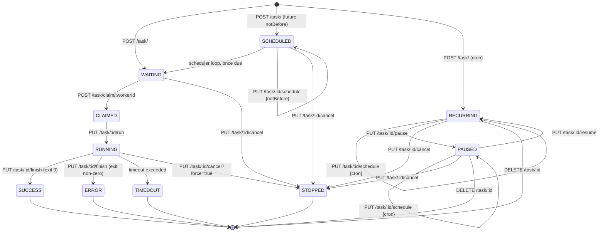
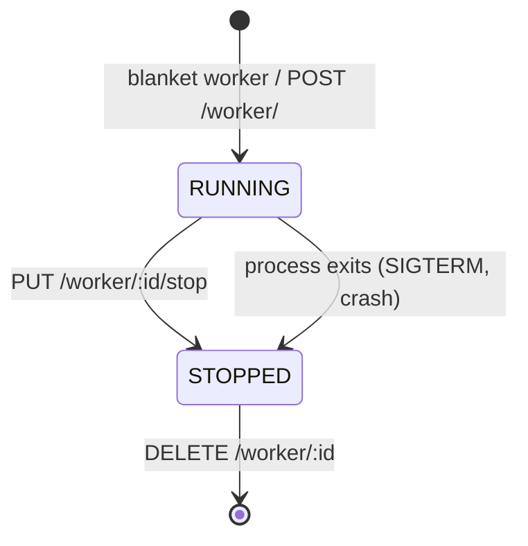
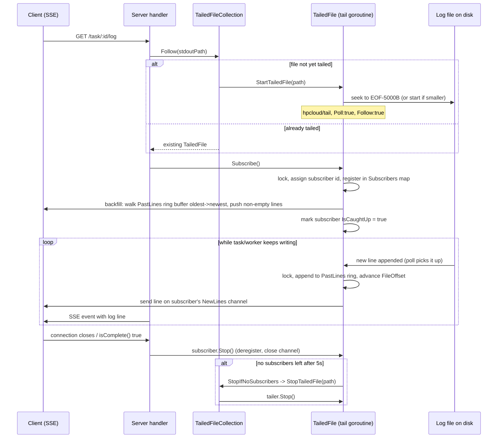

# Task Flow

This page documents the workflow that tasks go through, and the state
machines for tasks and workers.

## Task states

| State | Description |
| ------ | ------- |
| SCHEDULED | Task was submitted with a future `notBefore`; not yet in the queue. See "Scheduling" below. |
| RECURRING | Task is a recurring template (submitted with `cron`); never runs itself, only spawns children. See "Scheduling" below. |
| PAUSED | A RECURRING template that's been paused (`PUT /task/:id/pause`); carries a `pausedTs`. Never fires while paused; `PUT /task/:id/resume` returns it to RECURRING. See "Scheduling" below. |
| WAITING | Task has been posted but is not being worked on. The task is in the queue. |
| CLAIMED | A worker has requested this task. The task is now out of the queue and state is maintained only in the database. |
| RUNNING | The worker has executed the task preconditions (such as grabbing task type state, copying files) and the main command is now running. The worker may send additional updates during this state. |
| ERROR | The worker has encountered an error while running the task. Any non-zero status code is interpreted as an error. |
| SUCCESS | The worker has finished task execution. |
| STOPPED | The worker has received a command to stop execution of this task and the command has been killed. |
| TIMEDOUT | The task took longer than the allowed time and was killed. |

Valid states are listed in `tasks.ValidTaskStates` (`tasks/tasks.go`);
terminal states in `ValidTerminalTaskStates`.

## Task state machine

A task moves through one of two terminal paths: it is claimed and run
to completion (`SUCCESS` / `ERROR` / `TIMEDOUT`), or it is cancelled
(`STOPPED`) — either before a worker claims it, or after the worker
sees the cancellation tombstone and aborts. A RECURRING template has a
third path: it can be cancelled (`STOPPED`, record kept) or deleted
(record removed) directly, without ever running itself, and can cycle
through PAUSED any number of times first.


```mermaid
stateDiagram-v2
    [*] --> WAITING: POST /task/
    [*] --> SCHEDULED: POST /task/ (future notBefore)
    [*] --> RECURRING: POST /task/ (cron)
    SCHEDULED --> WAITING: scheduler loop, once due
    SCHEDULED --> SCHEDULED: PUT /task/:id/schedule {notBefore}
    SCHEDULED --> STOPPED: PUT /task/:id/cancel
    RECURRING --> RECURRING: scheduler loop fires a child at each cron occurrence
    RECURRING --> RECURRING: PUT /task/:id/schedule {cron}
    RECURRING --> PAUSED: PUT /task/:id/pause
    PAUSED --> RECURRING: PUT /task/:id/resume
    PAUSED --> PAUSED: PUT /task/:id/schedule {cron}
    RECURRING --> STOPPED: PUT /task/:id/cancel
    PAUSED --> STOPPED: PUT /task/:id/cancel
    RECURRING --> [*]: DELETE /task/:id
    PAUSED --> [*]: DELETE /task/:id
    WAITING --> CLAIMED: POST /task/claim/:workerId
    WAITING --> STOPPED: PUT /task/:id/cancel
    CLAIMED --> RUNNING: PUT /task/:id/run
    RUNNING --> SUCCESS: PUT /task/:id/finish (exit 0)
    RUNNING --> ERROR: PUT /task/:id/finish (exit non-zero)
    RUNNING --> TIMEDOUT: timeout exceeded
    RUNNING --> STOPPED: PUT /task/:id/cancel?force=true
    SUCCESS --> [*]
    ERROR --> [*]
    TIMEDOUT --> [*]
    STOPPED --> [*]
```

### Where a synchronous caller attaches (turtlemonvh/blanket#27)

`POST /task/?wait` changes nothing about the state machine above. The
task is saved, queued, claimed, run, and finished by exactly the same
transitions; the only difference is that the submitting request stays
open instead of returning at `WAITING`.

```
POST /task/?wait ──> WAITING ──> CLAIMED ──> RUNNING ──> SUCCESS/ERROR/TIMEDOUT
       │                                                        │
       └──────────────── the request is still open ─────────────┘
                              200 + completion payload
```

Mechanically, the handler subscribes to the server's task-event hub
*before* enqueueing (so a task that finishes unusually fast can't slip
through the gap), then wakes on the hub, on a ~1s fallback ticker, on the
request context being cancelled, or on the wait deadline — re-reading the
task record on every wake and stopping when it reads a terminal state.
The hub carries no payload and is a global broadcast, so the record is
always the source of truth; the notification is only a hint that
something changed.

Three consequences worth noting:

- **The wait expiring changes nothing.** The task keeps running through
  its normal transitions; the caller gets a 504 with the id and goes back
  to polling.
- **A disconnected client changes nothing either.** The handler returns,
  releases its subscription, and leaves the task alone.
- **`exitCode` is set on the `RUNNING → SUCCESS/ERROR` transition**, from
  the process status the worker reads after `cmd.Wait()`. Transitions
  where the process was killed (`STOPPED`, `TIMEDOUT`) leave it `null` —
  there is no exit status of the task's own to report.

### Scheduling: `scheduledTs` / recurring tasks (turtlemonvh/blanket#61)

By default a submitted task is immediately eligible to be claimed
(`WAITING`, in the queue). Two request fields on `POST /task/` change
that — see [api.md](api.md#tasks) for the exact field shapes:

- **`notBefore`** delays a one-shot task. If the resolved time is in the
  future, the task is saved to the database in state `SCHEDULED` with
  `scheduledTs` set, but is **not** added to the queue. It's otherwise a
  normal task record — visible via `GET /task/:id`, cancelable via `PUT
  /task/:id/cancel` (no `force` needed, same as `WAITING`).
- **`cron`** turns the submitted task into a `RECURRING` **template**. A
  template is never itself queued or run. Instead it carries `cronExpr`
  and `nextFireTs`; when `nextFireTs` is reached the scheduler spawns a
  **child task** — a fresh id, its own log/result directory, the
  template's type/env/tags, and `parentId` set to the template's id — and
  that child goes through the ordinary `WAITING` → ... lifecycle above.
  The template then advances `nextFireTs` to the next cron occurrence and
  waits again.

Both `SCHEDULED` tasks and `RECURRING` templates are ordinary rows in the
task database (BoltDB), so they survive a server restart with no special
handling: on restart the scheduler loop simply finds whatever is already
due and acts on it.

#### Series lifecycle: pause, resume, cancel, change schedule

A `RECURRING` template — and, for a couple of these, a `SCHEDULED`
one-shot task — can be managed after submission:

```
PUT /task/:id/pause              # RECURRING -> PAUSED; sets pausedTs
PUT /task/:id/resume             # PAUSED -> RECURRING; clears pausedTs,
                                  # recomputes nextFireTs from now
PUT /task/:id/cancel             # WAITING/SCHEDULED/RECURRING/PAUSED -> STOPPED
                                  # (RUNNING needs ?force=true, as always)
DELETE /task/:id                 # removes the record outright
PUT /task/:id/schedule           # {"cron": "..."} on a RECURRING/PAUSED
                                  # template, or {"notBefore": "..."} on a
                                  # SCHEDULED one-shot task
```

- **Pause** (`PUT /task/:id/pause`, valid only on `RECURRING`) moves the
  template to `PAUSED` and records `pausedTs`. A `PAUSED` template is
  never fired — the scheduler loop's fire step only ever looks at
  templates in state `RECURRING` in the first place (see below), so
  nothing extra is needed to make pausing take effect.
- **Resume** (`PUT /task/:id/resume`, valid only on `PAUSED`) moves it
  back to `RECURRING`, clears `pausedTs`, and recomputes `nextFireTs`
  from the current time — so a template paused for a long stretch
  doesn't immediately fire a backlog of "missed" occurrences on resume.
- **Cancel** (`PUT /task/:id/cancel`, now valid on `RECURRING` and
  `PAUSED` too, in addition to the original `WAITING`/`SCHEDULED`)
  transitions the template to `STOPPED` — the record is kept (so it
  still shows up in a series' history/detail view) but it will never
  fire again, for the same reason pausing works: only `RECURRING`
  templates are ever fired.
- **Delete** (`DELETE /task/:id`) still works exactly as before: it
  removes the record outright rather than leaving a `STOPPED` tombstone.
  Either way of stopping a template — cancel or delete — leaves any
  child it already spawned running to its own completion, unaffected;
  see "Past runs" below for listing those children.
- **Change schedule** (`PUT /task/:id/schedule`) edits the schedule of a
  live series without resubmitting it: a JSON body of `{"cron": "..."}`
  is valid on a `RECURRING` or `PAUSED` template (same cron format as
  submit; `nextFireTs` is recomputed from now if the template isn't
  paused — a paused template's `nextFireTs` is recomputed on resume
  instead), or `{"notBefore": "..."}` on a `SCHEDULED` one-shot task
  (same accepted formats as submit — duration/RFC3339/unix-seconds — and
  the resolved time must still be in the future). Any other combination
  of body and current state returns 400; an invalid cron/notBefore value
  returns 400 with the parser's message. A missing task id returns 404
  via the usual `ItemNotFoundError` convention.

#### Friendly schedule text

Every task response (`GET /task/:id`, `GET /task/`, and `POST /task/`'s
response) includes a computed `scheduleDescription` field, derived from
`state`/`cronExpr`/`scheduledTs` — nothing extra is stored for it:

- `SCHEDULED`: `"Once, at <scheduledTs formatted as RFC3339, local time>"`.
- `RECURRING` / `PAUSED` / a cancelled (`STOPPED`) template: an English
  description of the cron expression (e.g. `"Every 5 minutes"`), via
  [`github.com/lnquy/cron`](https://github.com/lnquy/cron) — annotated
  `" (paused)"` / `" (stopped)"` for those two states so the text is
  self-explanatory on its own (e.g. in `blanket ps` or an MCP tool
  result) without the state column alongside it.
  See `tasks.ScheduleDescriptionFor` (`tasks/schedule.go`).
- Anything else (including a `STOPPED` task that was never
  scheduled/recurring): `""`.

`GET /schedule/describe?cron=<expr>` returns the same description plus
the next three upcoming fire times, for a create form's live preview —
see [api.md](api.md#tasks) for the response shape.

#### Past runs

`GET /task/?parentId=<template-id>` lists a series' spawned child
runs — every ordinary task whose `parentId` matches the given template,
regardless of the template's own current state (`RECURRING`, `PAUSED`,
or `STOPPED`). Combine with the usual `states`/`limit`/etc. filters on
the same endpoint (e.g. `?parentId=<id>&states=ERROR`) to narrow further.

This is what the series detail page's "Past runs" table is built on, and
the inverse link (a run back to the series that spawned it) is the series
card on a task's detail page — see [usage.md](usage.md#web-ui).

#### Scheduler loop

A single background goroutine, started from `ServerConfig.Serve()` via
`startBackgroundLoops` (`server/scheduler.go`), ticks on a configurable
interval (`scheduler.interval` config key, default `2s`) and each tick:

1. **Promotes due `SCHEDULED` tasks**: finds every `SCHEDULED` task whose
   `scheduledTs` has passed, flips it to `WAITING`, and adds it to the
   queue. Safe to run more than once for the same task — the DB write is
   a plain overwrite and the queue add upserts by task id — so an
   overlapping tick or a restart mid-promotion can't double-queue a task.
2. **Fires due `RECURRING` templates**: finds every template in state
   `RECURRING` (not `PAUSED`, not `STOPPED`) whose `nextFireTs` has
   passed, spawns a child task for it, and only then advances
   `nextFireTs`. If the server crashes between spawning the child and
   advancing `nextFireTs`, the template is found due again on restart
   and fires an equivalent child a second time — an at-least-once
   guarantee, not exactly-once. Task types driven by cron should be
   written to tolerate an occasional duplicate run, the same way a
   `cron(8)`-driven script generally should.

`startBackgroundLoops` is written so a second periodic loop can be added
alongside the scheduler with one more line — see the FIXME it replaced in
`server/server.go`; turtlemonvh/blanket#23 phase 3 plans to add a reaper
loop there (stalled workers/tasks, unclaimed-queue cleanup).

#### Scan limit: `scheduler.maxScheduled`

Both scheduler-loop queries above (and the count check below) are bounded
by a single config key, `scheduler.maxScheduled` (default `10000`) —
`ServerConfig.SchedulerMaxScheduled`, wired through the same
config/viper path as `scheduler.interval`. There's no pagination beyond
this limit: each scheduler tick scans at most that many rows per query,
fine at the scale this feature targets (batch task scheduling, not a
high-volume cron system), but a deployment leaning on scheduling far more
heavily than that would need these loops to page through results
instead.

The same number doubles as a hard cap: `POST /task/` (and the MCP
`blanket_submit_task` tool) returns **HTTP 429** with a JSON error body
when accepting a `notBefore`-in-the-future or `cron` submission would
bring the count of live `SCHEDULED` + `RECURRING` + `PAUSED` tasks to or
past the limit. That count is itself a bounded query rather than an
unbounded scan: it uses the same `scheduler.maxScheduled`-sized
`Limit` the scheduler's own queries use, so it never examines more than
`scheduler.maxScheduled` rows regardless of how many exist beyond that
(`ServerConfig.scheduledLiveCount`, `server/scheduler.go`). An
immediately-`WAITING` submission (no schedule, or a past `notBefore`)
never counts against this limit.

### Stopping a RUNNING task

`PUT /task/:id/cancel` on a WAITING task is a pure database transition — the
task was never claimed, so there's nothing else to signal. On a RUNNING task
it's more consequential: the task's OS process is a subprocess of some
*worker*, not the server, so the server can't kill it directly. Cancelling a
RUNNING task therefore requires an explicit `?force=true`; without it the
endpoint returns 400 and leaves the task alone.

With `force=true`, the server does its half — flip the task to `STOPPED` in
the database — and relies on the worker to do the rest. Each worker's
`ProcessOne` (`worker/worker.go`) runs a monitor goroutine alongside the
subprocess that polls the task's state every `CheckInterval` (same interval
the worker already uses for its claim loop); when it observes `STOPPED` it
kills the subprocess (`cmd.Process.Kill()`) and returns. So "stopping" a
RUNNING task is: server sets the tombstone, worker's next poll notices it and
kills the process — no direct server-to-worker RPC involved. Worst case, the
subprocess keeps running for up to one `CheckInterval` after the cancel call
before it's killed.

### Idempotent transitions and the `runId` fencing token

`PUT /task/:id/run` and `PUT /task/:id/finish` are retried by the worker
(turtlemonvh/blanket#23 phase 1), so both are idempotent. Each execution
attempt carries a **fencing token**, `runId`, that the worker generates
immediately before starting the child process and repeats on every
transition for that run:

- A repeat carrying the **same** token is a 200 no-op — the worker asked
  for something already done and simply never heard the answer.
- A **different** token is a 409: two runners believe they own this task.
  The worker never retries a 409.
- An **empty** token is legacy-permissive, so workers built before the
  token keep working until the schema bump in phase 4 of #23.

The first terminal state a task reaches is the one that sticks. A user's
`STOPPED` therefore beats the `ERROR` the worker reports a moment later
when the killed child exits — and the worker is told 200, not an error, so
it stops retrying and cleans up. The full table is in
[api.md](api.md#tasks).

### Outcome journal

While a task is running, its worker keeps a small journal next to the
task's logs:

```
<resultDir>/blanket.outcome.json
```

It exists so the real outcome of a run survives the worker process. If a
worker is killed — an upgrade, an OOM, a power cut — between the child
exiting and the server acknowledging the finish, the task record still says
`RUNNING` and the outcome would otherwise be gone. Guessing at it is not
acceptable: misclassifying a finished three-hour render as `ERROR` is
exactly the failure [design.md](design.md) says not to have.

The worker **never reads the journal back**. Its consumer is the reaper
added in phase 3 of #23, which makes the two fully decoupled: nothing on
the running path depends on the journal being readable, so every write to
it fails open (logged at warn, task unaffected).

Writes are atomic — temp file in the same directory, `fsync`, `rename`,
then `fsync` of the directory — so a reader after a crash sees either the
previous contents or the new ones, never a mix.

Lifecycle:

| When | `state` | Meaning if found later |
| --- | --- | --- |
| `cmd.Start()` succeeded | `running` | The worker died with the task in flight. Check whether `pid` is still alive before doing anything. |
| child exited | `exited` | The outcome is known (`exitCode`, `exitedTs`) and was never reported. This is the case worth recovering. |
| server acknowledged the finish | `reported` | The worker died between the ack and the unlink. Nothing to recover; the file can just be removed. |
| — | *(file deleted)* | Normal completion. |

Schema (`worker.OutcomeJournal`, `worker/journal.go`):

```json
{
  "version": 1,
  "state": "exited",
  "runId": "6a9c504d0372dcda2a889777",
  "taskId": "6a9c504d0372dcda2a889776",
  "workerId": "6a9c504d0372dcda2a889775",
  "pid": 48213,
  "pidStartTs": 0,
  "startedTs": 1757088000,
  "exitedTs": 1757088012,
  "exitCode": 0
}
```

- `version` — bumped only on an incompatible schema change.
- `runId` — the same fencing token sent on the run/finish transitions, so a
  reader can tell whether the journal describes the run the task record is
  currently about or a stale earlier attempt.
- `pid` / `pidStartTs` — the **child** process, not the worker.
  `pidStartTs` guards against pid reuse; it stays `0` ("unknown") until
  phase 3 adds the per-platform liveness package that can read it, and a
  reader must treat a zero value as inconclusive rather than assuming the
  pid is this process.
- `exitCode` — `0` for success, the process's code for a non-zero exit,
  `-1` when it was killed by a signal (a timeout kill or a user cancel).
  It is the *same* status read the worker reports on
  `PUT /task/:id/finish?exitCode=` (turtlemonvh/blanket#27), taken once
  after `cmd.Wait()`, so the journal and the task record can never
  disagree. Only the encoding of "killed by a signal" differs: the
  journal writes `-1`, the task record writes `null`, because a task's
  `exitCode` field has to keep "unknown" distinguishable from a genuine
  exit 0.

## Worker state machine

Workers have a simpler model: a single `Stopped` boolean on the
`WorkerConf` (`worker/worker.go`). A running worker polls the queue
on its `CheckInterval`; setting `Stopped = true` (via
`PUT /worker/:id/stop` or the worker process exiting) takes it out
of the claim loop. Workers can only be deleted once stopped.

`Stopped` is **server-owned**. `PUT /worker/:id` merges at the field level
rather than overwriting the record (turtlemonvh/blanket#23 phase 1): the
worker owns `pid`, `logfile`, `startedTs`, `tags` and `checkInterval`, and
the server owns `stopped` and `lastHeardTs`. Without that split, a worker
re-registering — which it always does with `stopped: false` — silently
undid a stop that had just landed, and carried on claiming tasks. It also
means restarting a worker has to clear the flag server-side, which is what
`PUT /worker/:id/restart` now does before relaunching the process.


```mermaid
stateDiagram-v2
    [*] --> RUNNING: blanket worker / POST /worker/
    RUNNING --> STOPPED: PUT /worker/:id/stop
    RUNNING --> STOPPED: process exits (SIGTERM, crash)
    STOPPED --> [*]: DELETE /worker/:id
```

(The claim loop itself — what `RUNNING` is doing between transitions — is
its own diagram in the next section.)

A worker that has stopped reporting heartbeats (`lastHeardTs`) is
considered "lost" by the UI but is not a distinct state in the data
model — there is no automatic transition; an operator must stop or
delete it explicitly.

## Worker claim loop

`WorkerConf.ProcessTasks` (`worker/worker.go`) is the loop a worker runs
while in the `RUNNING` state above. Each iteration: refresh
the worker's own config from the server (so a `stop` request lands
before the next claim attempt), try to claim a task, and — if one was
claimed — run it via `ProcessOne` before looping again. Every step is
a plain HTTP call to the server (`tasks/task_client.go`); the worker
process never touches BoltDB directly. An empty queue or a transient
error is not fatal — the loop sleeps `CheckInterval` and retries. No
sleep happens after successfully processing a task, so the worker
drains a backlog without waiting out the interval between each one.

Every sleep in the loop is jittered (turtlemonvh/blanket#23 phase 1). An
ordinary poll waits a full `CheckInterval` plus up to a quarter of one; a
failed iteration waits a **full-jitter** backoff instead —
`rand(0, min(CheckInterval << n, 30s))` — which also spreads out the first
poll after a reconnect. The failure this defends against is a server
restart, which every worker on the machine sees at the same instant:
without jitter they reconnect in lockstep and stay that way.

A `SIGTERM` sets a local stop flag as well as asking the server to mark the
worker stopped, so the loop exits even when the server is permanently
unreachable — the shutdown path is bounded rather than dependent on a
round trip.

```mermaid
sequenceDiagram
    participant W as Worker (ProcessTasks)
    participant S as Server
    participant Q as Queue (lib/queue)
    participant DB as BoltDB
    participant P as Task subprocess
    participant J as Outcome journal (disk)

    loop until Stopped
        W->>S: GET /worker/:id (Refetch)
        S-->>W: worker config (incl. Stopped)
        alt refetch failed
            W->>W: sleep(CheckInterval)
        else refreshed ok
            W->>S: POST /task/claim/:workerId
            S->>Q: ClaimTask(worker)
            Q-->>S: task (or ErrQueueEmpty)
            S->>DB: SaveTask (state -> CLAIMED)
            S-->>W: 200 + task JSON, or 204 No Content
            alt no matching task
                W->>W: sleep(CheckInterval)
            else task claimed
                W->>P: start task command (exec.Cmd)
                W->>J: write journal (state=running, runId, pid)
                W->>S: PUT /task/:id/run?runId=...
                S->>DB: RunTask (state -> RUNNING, stores runId)
                loop while process runs
                    W->>S: GET /task/:id (Refresh, check for cancel)
                    Note over W,S: refresh error -> keep running (fail open)
                    W->>P: kill on cancel or timeout
                end
                P-->>W: process exits
                W->>J: write journal (state=exited, exitCode)
                W->>S: PUT /task/:id/finish?state=SUCCESS|ERROR|TIMEDOUT&runId=...
                Note over W,S: retried with full jitter; 409/404/400 are not retried
                S->>DB: FinishTask
                W->>J: write journal (state=reported), then delete it
            end
        end
    end
```

## Basic task flow

This is what the workflow looks like without any user intervention or
failures.

### 0. Preconditions / Assumptions

We start out with the assumptions that:

1. Blanket itself is running.
2. Workers are running, and they can consume tasks.

### 1. User posts task

User sends `POST /task/`. They receive back an id for their task.
The task is put in both the database and the queue. The write to the
database is performed first.

### 2. Worker claims task

Workers do not claim specific tasks. They send a specification of their
capabilities to the server via `POST /task/claim/:workerId`. The server
responds by executing a series of actions:

1. Find a task that matches that worker's capability in the queue.
2. Insert that task into the database in the `CLAIMED` state, and ack the message from the queue.
3. Return the task id of the claimed task to the worker.

### 3. Worker begins task execution

Upon receipt of this task id from the server, the worker starts
performing its own series of actions to advance the task state:

1. Grab the task type information.
2. Create an isolated execution directory for the task. Copy any template files in this directory and fill them out.
3. Start executing the main task command.
4. Send a `PUT /task/:id/run` back to the server to request the server advances the task state to `RUNNING`.

> Note that **the task config is not locked when the task is added**,
> but when it is executed. If you change the input files in the time
> between when a task is added and when it is executed, you will
> execute the new version of the task. This may change in the future.

During execution, the worker may send multiple requests to
`PUT /task/:id/progress` to update the percent completion of the task,
or adjust other task attributes.

### 4. Worker completes task execution

Assuming the task execution completes without any errors, timing out,
or being stopped by the user, the worker will then:

1. Send a request to `PUT /task/:id/finish` to mark the task as complete.
2. Ask the server for another task.

## Log tailing (`lib/tailed_file`)

`GET /task/:id/log` and `GET /worker/:id/log` (`server/serve_tasks.go`,
`server/serve_workers.go`) stream a running task's or worker's log file
to the browser over SSE. Both call `tailed_file.Follow(path)`, which is
backed by a single `TailedFileCollection`: the first subscriber for a
given path starts a `TailedFile` — an `hpcloud/tail` goroutine that
seeks to end-of-file minus `DefaultFileOffset` (5000 bytes, or the
start of the file if it's smaller) and polls for new lines — and later
subscribers on the same path reuse it. A `TailedFile` keeps the last
`DefaultLinesKept` (100) lines in a ring buffer (`PastLines`), so a new
subscriber can be **backfilled** with recent history instead of only
seeing lines written after it subscribed. The file stops being tailed
5 seconds after its last subscriber unsubscribes (`StopIfNoSubscribers`).


```mermaid
sequenceDiagram
    participant C as Client (SSE)
    participant Srv as Server handler
    participant TFC as TailedFileCollection
    participant TF as TailedFile (tail goroutine)
    participant Log as Log file on disk

    C->>Srv: GET /task/:id/log
    Srv->>TFC: Follow(stdoutPath)
    alt file not yet tailed
        TFC->>TF: StartTailedFile(path)
        TF->>Log: seek to EOF-5000B (or start if smaller)
        Note over TF: hpcloud/tail, Poll:true, Follow:true
    else already tailed
        TFC-->>Srv: existing TailedFile
    end
    Srv->>TF: Subscribe()
    TF->>TF: lock, assign subscriber id, register in Subscribers map
    TF->>C: backfill: walk PastLines ring buffer oldest->newest, push non-empty lines
    TF->>TF: mark subscriber IsCaughtUp = true

    loop while task/worker keeps writing
        Log->>TF: new line appended (poll picks it up)
        TF->>TF: lock, append to PastLines ring, advance FileOffset
        TF->>C: send line on subscriber's NewLines channel
        Srv->>C: SSE event with log line
    end

    C->>Srv: connection closes / isComplete() true
    Srv->>TF: subscriber.Stop() (deregister, close channel)
    alt no subscribers left after 5s
        TF->>TFC: StopIfNoSubscribers -> StopTailedFile(path)
        TFC->>TF: tailer.Stop()
    end
```
